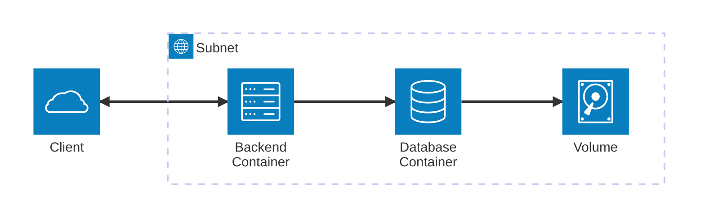

# Logged.me REST API Server

Logged.me<sup>기업의 헤드헌팅 및 취준생을 위한 기록관리 서비스</sup> 의 백엔드 서버입니다.

Django 및 Django REST Framework 를 이용하여 구현되었습니다.


## Architecture



* 백엔드 서버와, 데이터베이스는 모두 단일 컨테이너로 구성됩니다.
* 데이터베이스에 장애가 발생하여도 데이터가 소실되는 것을 방지하기 위해 볼륨을 구성해주어야 합니다.

## Prerequisites

- Docker (배포 및 개발)
- Python3.8^ (개발 시에만 필요)

## Setup Instructions

본 애플리케이션 구동을 위해서는 두 개의 컨테이너(Backend, Database)가 가동되어야 합니다.

1. 백엔드(Django) 컨테이너: `loggedme-backend`
2. 데이터베이스(PostgreSQL) 컨테이너: `loggedme-database`

서브넷 상에서 배포한다면, 백엔드 컨테이너 호스트의 `80`번 포트에 대하여 Inbound, Outbound 가 허용되어야 정상적인 서비스 제공이 가능합니다.

### Manual Deployment

### 네트워크 및 볼륨 생성

(Docker의) 사용자 지정 네트워크를 정의하여 데이터베이스와 백엔드 서버에 사용할 것입니다.

```shell
docker network create loggedme-network
```

데이터베이스 서버에 장애가 발생하거나, 재가동 시키게 되더라도 데이터가 보존될 수 있도록 볼륨을 구성하여 사용합니다.

```shell
docker volume create loggedme-volume
```

### 데이터베이스 컨테이너

공개된 PostgreSQL 서버 이미지(`postgres:alpine`)를 사용합니다.

```shell
docker run -d --name loggedme-database \
  --network loggedme-network \
  -v loggedme-volume:/var/lib/postgresql/data \
  -e POSTGRES_DB='loggedme' \
  -e POSTGRES_USER='loggedme' \
  -e POSTGRES_PASSWORD='loggedme!password' \
  postgres:alpine
```

> 환경 변수에 정의된 DB명과, DB 사용자, DB 비밀번호는 적절히 변경하여 사용해주세요.

### 백엔드 컨테이너

백엔드 컨테이너의 이미지는 본 레포지토리의 Dockerfile을 바탕으로 직접 빌드하여 사용하셔야 합니다.

```shell
docker build -t loggedme-backend .
```

이미지 빌드가 완료되면 아래의 명령을 통해 서버를 구동합니다.

```shell
docker run -d --name loggedme-backend \
  --network loggedme-network \
  -p 80:8000 \
  -e SECRET_KEY='loggedme!secret' \
  -e POSTGRES_HOST='loggedme-database' \
  -e POSTGRES_DB='loggedme' \
  -e POSTGRES_USER='loggedme' \
  -e POSTGRES_PASSWORD='loggedme!password' \
  loggedme-backend
```

> 데이터베이스 컨테이너 구동 때와 마찬가지로,
> 환경 변수에 정의된 DB명과, DB 사용자, DB 비밀번호는 적절히 변경하여 사용해주세요.
>
> `SECRET_KEY` 는 Django 프레임워크에서 제공하는 `User` 모델의 비밀번호 암호화에 사용되는 키입니다.
> 보안과 직결되므로 적절히 변경하여 사용해주세요.
>
> 편의상 내부 포트 `8000`번을 외부 포트 `80`번으로 포워드하여 사용하고 있으니, 필요에 따라 변경하여 사용해주세요.

### Superuser 추가

백엔드 컨테이너 구동 시, 환경변수에 `DEBUG=true` 를 추가하면 관리자 계정으로 로그인 한 뒤, `/admin/` 주소를 통해 관리자 페이지에 접근할 수 있습니다.

새로운 관리자 계정이 필요하다면 아래의 명령을 통해 컨테이너에서 Django Shell을 열고 코드를 실행하여 관리자를 추가할 수 있습니다.

```shell
docker exec -it loggedme-backend /app/manage.py shell
```

Python 언어를 입력받는 InteractiveConsole이 나타났다면 아래의 코드를 실행합니다.

```python
from user.models import User, UserType

User.objects.create_superuser("admin", password="adminpwd", account_type=UserType.PERSONAL)

exit()
```

정상적으로 계정이 생성되었다면 관리자 페이지에서 Username: `admin`, Password: `adminpwd`로 로그인 할 수 있습니다.
